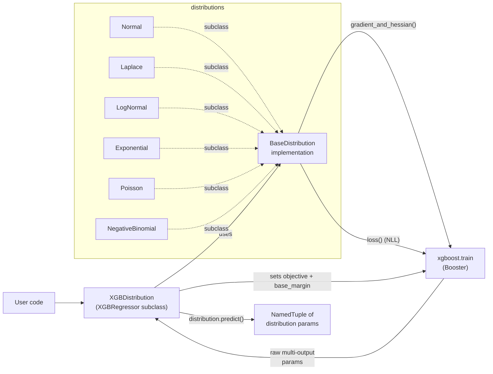
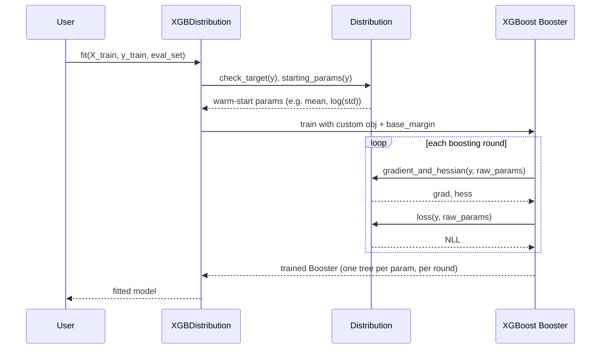
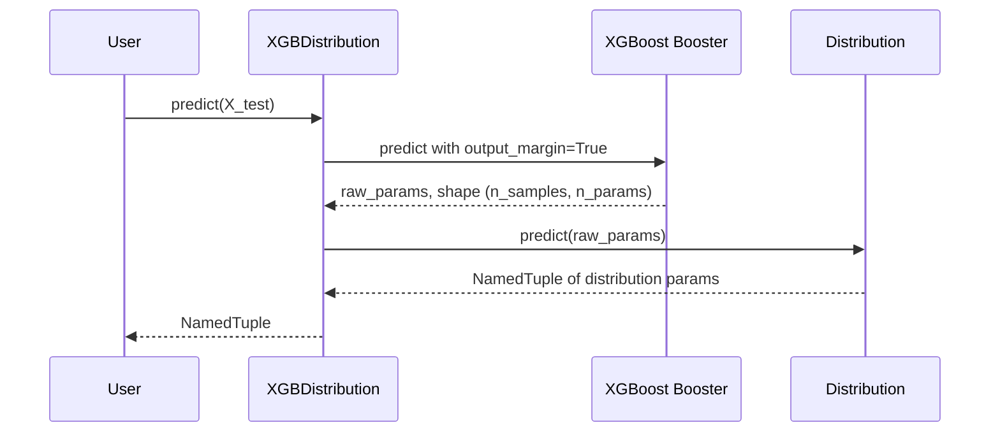

# Architecture

`xgboost-distribution` extends [XGBoost's scikit-learn `XGBRegressor`](https://xgboost.readthedocs.io/en/latest/python/python_api.html#xgboost.XGBRegressor) so that it estimates the parameters of a chosen probability distribution rather than a single point value. It does this with a **custom XGBoost objective** that computes per-parameter gradients and (optionally) **natural gradients** via the Fisher information.

## High-level layout

```
src/xgboost_distribution/
├── __init__.py              # exports XGBDistribution
├── model.py                 # XGBDistribution(XGBRegressor) — sklearn-compatible model
├── metrics.py               # log-likelihood scorers for sklearn (e.g. GridSearchCV)
├── utils.py                 # JSON serialisation helpers
└── distributions/
    ├── base.py              # BaseDistribution (abstract)
    ├── normal.py            # Normal distribution (loc, scale)
    ├── laplace.py           # Laplace (loc, scale)
    ├── log_normal.py        # LogNormal (scale, s)
    ├── exponential.py       # Exponential (scale)
    ├── poisson.py           # Poisson (mu)
    ├── negative_binomial.py # NegativeBinomial (n, p)
    └── utils.py             # numerical safety helpers (safe_exp, MIN/MAX_EXPONENT)
```

The two important pieces are:

1. **`XGBDistribution`** — a subclass of `XGBRegressor`. It plugs a distribution-aware objective and evaluation function into the standard XGBoost training loop, then re-shapes the booster's raw outputs into named distribution parameters at predict time.
2. **`BaseDistribution`** — abstract interface that every distribution implements. Distributions are stateless; they only define `params`, `starting_params`, `gradient_and_hessian`, `loss`, and `predict`.

## Component diagram



## Training data flow



## Prediction data flow

`predict()` calls XGBoost with `output_margin=True` to get the booster's raw multi-output, then hands that to the distribution's `predict()` to map raw outputs back into interpretable parameters (e.g. apply `exp` to `log_scale` so `scale > 0`).



## Key design decisions

### Reparameterisation for unconstrained training

XGBoost's leaf values are unconstrained real numbers, but distribution parameters often have constraints (`scale > 0`, `0 < p < 1`, `n >= 0`, …). Each distribution **reparameterises** so the booster can output any real value:

| Distribution | Constrained param | Reparameterised as |
| --- | --- | --- |
| Normal | `scale > 0` | `log(scale)` |
| Laplace | `scale > 0` | `log(scale)` |
| LogNormal | `s > 0` | `log(s)` |
| Exponential | `scale > 0` | `log(scale)` |
| Poisson | `mu > 0` | `log(mu)` |
| NegativeBinomial | `n > 0`, `0 < p < 1` | `log(n)`, `logit(p)` |

The `predict()` method on each distribution applies the inverse transform.

### Natural gradients

By default, `XGBDistribution` uses **natural gradients** (`natural_gradient=True`). Instead of `g`, it computes `g_natural = F⁻¹ · g`, where `F` is the (reparameterised) Fisher information matrix of the distribution. This was first applied to gradient boosting in [NGBoost](https://github.com/stanfordmlgroup/ngboost) and gives more stable updates when the parameter space is curved (e.g. variance directions for Normal).

For Normal, LogNormal, Exponential, and Poisson, `F` is diagonal in its reparameterised form, so `F⁻¹ · g` reduces to element-wise division by the diagonal entries — no matrix solve is needed. The implementation casts each diagonal entry to `float32` before dividing, matching the legacy `numpy.linalg.solve` path bit-for-bit on a `float32` Fisher matrix.

**Laplace** uses the algebraically simplified `sign(loc - y) * scale` form for the location column directly. This is mathematically equivalent to dividing by the diagonal `1/scale²` but avoids the `scale²` intermediate, which overflows float32 when `safe_exp` is near its upper clip. The simplification is *not* bit-identical to the legacy solve at the ulp level, only mathematically equivalent.

**NegativeBinomial** uses a **diagonal approximation**: the off-diagonal cross term `F_ab = -n(1-p)` is dropped, and each diagonal entry is floored at `DIAG_FLOOR` (≈ 1e-30) before division to prevent float32 underflow at the parameter clipping boundaries. The raw gradient is also computed in float64 (and column 1 uses the algebraic form `p*y - n*(1-p)` rather than `p*(y - n*(1-p)/p)`) so the intermediates don't overflow float32 at the upper-clip boundary. As a result NegativeBinomial is **not bit-identical** to the legacy `linalg.solve` path — it matches within a few float32 ulps on non-extreme inputs and stays finite at the clipping boundaries. See the class docstring in [`negative_binomial.py`](../src/xgboost_distribution/distributions/negative_binomial.py) for the derivation and caveats.

Set `natural_gradient=False` to fall back to vanilla gradients with a diagonal Hessian.

### `base_margin` instead of `base_score`

`XGBDistribution` sets `base_score=0` and supplies a per-parameter `base_margin` that equals `distribution.starting_params(y)`. This means each distribution parameter starts the boosting from a sensible warm point (e.g. mean and log-std of `y` for Normal), which dramatically reduces the number of rounds needed to reach reasonable estimates.

### Stateless distributions, serialisable models

Distribution classes hold no fitted state — they're pure functions. The trained `XGBDistribution` stores only:

- the underlying `Booster`,
- the distribution name (set via `Booster.set_attr("distribution", ...)`),
- the starting params (JSON-serialised on the booster).

This means [`save_model` / `load_model`](../src/xgboost_distribution/model.py) work through XGBoost's native serialisation; no pickle is required.

## Adding a new distribution

To add a distribution `Foo`:

1. Create `src/xgboost_distribution/distributions/foo.py`.
2. Implement `Foo(BaseDistribution)` with `params`, `starting_params`, `gradient_and_hessian`, `loss`, and `predict`. Reparameterise any constrained params, and document the math (see [`normal.py`](../src/xgboost_distribution/distributions/normal.py) for the template).
3. Import it in [`distributions/__init__.py`](../src/xgboost_distribution/distributions/__init__.py) — `AVAILABLE_DISTRIBUTIONS` will pick it up automatically via `BaseDistribution.__subclasses__()`.
4. Add a logpdf/logpmf entry for it in [`metrics.py`](../src/xgboost_distribution/metrics.py) under `dist_ll`, including the parameter-name tuple in `scipy.stats` order.
5. Add tests under `tests/distributions/`.
